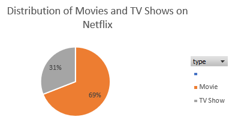
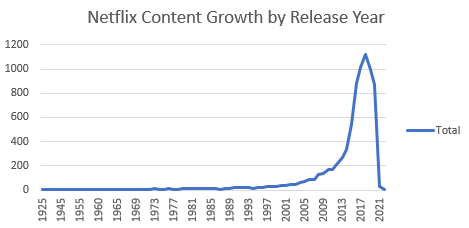
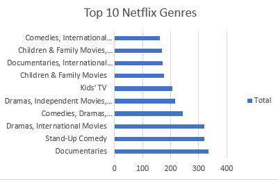

# Netflix Content Analysis

## Project Overview
This project explores the Netflix content catalog using a public dataset.  
The analysis was conducted using Microsoft Excel and focuses on understanding the distribution and trends of Netflix titles.

## Dataset
The dataset contains information about Netflix titles including:
- title
- type (Movie or TV Show)
- country
- release year
- genre

## Key Questions
1. What is the distribution between Movies and TV Shows?
2. How has Netflix content grown over time?
3. What are the most common genres?
4. Which countries produce the most Netflix content?

## Tools Used
- Microsoft Excel
- Pivot Tables
- Data Visualization
- GitHub for documentation

## Analysis Process

The dataset was analyzed using Microsoft Excel. The following steps were performed:

1. Importing the dataset into Excel.
2. Cleaning the data and checking for missing values.
3. Creating Pivot Tables to summarize the data.
4. Building visualizations such as charts to identify trends and patterns.

## Visualizations
## Distribution of Movies vs TV Shows

## Content Growth Over Time

## Top Genres

## Key Insights

**Movies dominate the platform**  
Movies represent the majority of titles available on Netflix.

**Content growth accelerated after 2017**  
Netflix experienced a major increase in titles between 2017 and 2020.

**Documentaries appear frequently in the catalog**  
Documentary content forms a significant portion of the dataset.

**The United States produces the most content**  
The US leads the dataset, followed by India and the United Kingdom.

## Conclusion

The analysis shows that Netflix has rapidly expanded its content catalog in recent years, with movies forming the majority of available titles. The platform also features content from multiple countries, highlighting its global reach.
